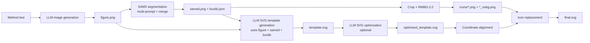

<div align="center">


# AutoFigure-edit: Generating and Editing Publication-Ready Scientific Illustrations [ICLR 2026]

[](https://openreview.net/forum?id=5N3z9JQJKq)
[](https://opensource.org/licenses/MIT)
[](https://www.python.org/)
[](https://huggingface.co/datasets/WestlakeNLP/FigureBench)

<p align="center">
  <strong>From Method Text to Editable SVG</strong><br>
  AutoFigure-edit is the next version of AutoFigure. It turns paper method sections into editable SVG figures and lets you refine them in an embedded SVG editor.
</p>

[Quick Start](#-quick-start) • [Web Interface](#-web-interface) • [How It Works](#-how-it-works) • [Configuration](#-configuration) • [Citation](#-citation--license)

[[`Paper`](https://openreview.net/forum?id=5N3z9JQJKq)]
[[`Project`](https://github.com/ResearAI/AutoFigure)]
[[`BibTeX`](#-citation--license)]

</div>

---

## ✨ Features

| Feature | Description |
| :--- | :--- |
| 📝 **Text-to-Figure** | Generate a draft figure directly from method text. |
| 🧠 **SAM3 Icon Detection** | Detect icon regions from multiple prompts and merge overlaps. |
| 🎯 **Labeled Placeholders** | Insert consistent AF-style placeholders for reliable SVG mapping. |
| 🧩 **SVG Generation** | Produce an editable SVG template aligned to the figure. |
| 🖥️ **Embedded Editor** | Edit the SVG in-browser using the bundled svg-edit. |
| 📦 **Artifact Outputs** | Save PNG/SVG outputs and icon crops per run. |

---

## 🚀 How It Works

AutoFigure-edit follows the exact pipeline implemented in `autofigure2.py`.



Key details:
- Placeholder mode controls how icon boxes are encoded (`label`, `box`, or `none`).
- `optimize_iterations=0` skips the optimization step and uses `template.svg` directly.

---

## ⚡ Quick Start

### Option 1: CLI

```bash
# 1) Install dependencies
pip install -r requirements.txt

# 2) Install SAM3 separately (not vendored in this repo)
git clone https://github.com/facebookresearch/sam3.git
cd sam3
pip install -e .
```

**Run:**

```bash
python autofigure2.py \
  --method_file paper.txt \
  --output_dir outputs/demo \
  --provider bianxie \
  --api_key YOUR_KEY
```

### Option 2: Web Interface

```bash
python server.py
```

Then open `http://localhost:8000`.

---

## 🧩 SAM3 Installation Notes

AutoFigure-edit depends on SAM3 but does **not** vendor it. Please follow the
official SAM3 installation guide and prerequisites. The upstream repo currently
targets Python 3.12+, PyTorch 2.7+, and CUDA 12.6 for GPU builds.

SAM3 checkpoints are hosted on Hugging Face and may require you to request
access and authenticate (e.g., `huggingface-cli login`) before download.

- SAM3 repo: https://github.com/facebookresearch/sam3
- SAM3 Hugging Face: https://huggingface.co/facebook/sam3

## ⚙️ Configuration

### Supported LLM Providers

| Provider | Base URL | Notes |
|----------|----------|------|
| **OpenRouter** | `openrouter.ai/api/v1` | Supports Gemini/Claude/others |
| **Bianxie** | `api.bianxie.ai/v1` | OpenAI-compatible API |

Common CLI flags:

- `--provider` (openrouter | bianxie)
- `--image_model`, `--svg_model`
- `--sam_prompt` (comma-separated prompts)
- `--merge_threshold` (0 disables merging)
- `--optimize_iterations` (0 disables optimization)
- `--reference_image_path` (optional)

---

## 📁 Project Structure

<details>
<summary>Click to expand directory tree</summary>

```
AutoFigure-edit/
├── autofigure2.py         # Main pipeline
├── server.py              # FastAPI backend
├── requirements.txt
├── web/                   # Static frontend
│   ├── index.html
│   ├── canvas.html
│   ├── styles.css
│   ├── app.js
│   └── vendor/svg-edit/   # Embedded SVG editor
└── img/                   # README assets
```
</details>

---

## 🤝 Community & Support

**WeChat Discussion Group**  
Scan the QR code to join our community. If the code is expired, please contact `tuchuan@mail.hfut.edu.cn`.


---

## 📜 Citation & License

If you use AutoFigure-edit in academic work, please cite this repository and the original AutoFigure project.

```bibtex
@software{autofigure_edit2026,
  title = {AutoFigure-edit: Generating and Editing Publication-Ready Scientific Illustrations},
  author = {AutoFigure-edit contributors},
  year = {2026},
  url = {https://github.com/your-org/AutoFigure-edit}
}
```

This project is licensed under the MIT License - see `LICENSE` for details.